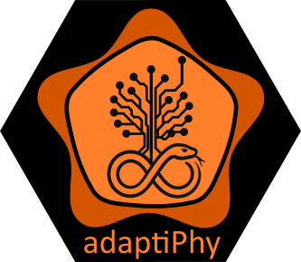

<p align="center">
  
</p>


# AdaptiPhy: Implementation with snakemake

This code updates the existing AdaptiPhy 2.0 pipeline to run using snakemake, allowing the user to plug in data at the beginning of the pipeline & performing the intermediate steps automatically and reproducibly. 

If you are a snakemake 1.0 user, we have deprecated the original version and those files can be found in this repo under the folder 'deprecated'.

## 1. Downloading the AdaptiPhy pipeline 2.0 to run with snakemake ##

### 1a. Recommended: Download the tarball release from the "Releases" page ###

To use the AdaptiPhy 2.0 compressed static release, please navigate to the [Releases](https://github.com/wodanaz/adaptiPhy/releases/tag/v2.0.0) menu on the right-hand side of this README landing page. Please note that the test data to confirm that AdaptiPhy is functioning properly must be separately downloaded from Zenodo and moved into a subdirectory called "data". This option is ready, please download and unzip the file.

### 1b. Not 100% recommended: Clone the git repo ###

To clone this repo from the command line into your working directory, use:

```bash
git clone https://github.com/wodanaz/adaptiPhy
```

You will need to add your files to the ```data/``` directory before running the snakemake pipeline for the first time (or download the test data from Zenodo as described above). Read on for more info about the necessary file structure in this folder!

### 2. Dependencies: Installing snakemake in a conda environment ###
The majority of the conda packages required in the pipeline will be loaded automatically, and you will not need to do any sort of manual install. However, you will need to create a top-level environment that contains snakemake and python in order to run this pipeline.

Please install it in a directory of your choosing where you keep conda environments. You can use the following .yaml file structure:

```
nano snakemake.yml 
```

```
name: snakemake
channels:
  - conda-forge
  - bioconda
  - defaults
dependencies:
  - snakemake=9.1
  - python=3.11
  - snakemake-executor-plugin-slurm
  - bzip2
```

Note that `snakemake-executor-plugin-slurm` and `bzip2` may be excluded if you have no intention of running AdaptiPhy on a SLURM-managed computing cluster and/or prefer to decompress files with a tool other than bzip2.


To initialize a conda environment from this .yaml file:

```
conda env create --file snakemake.yml 
```

To invoke or activate this environment to run AdaptiPhy 2.0, load it with:

```
conda activate snakemake
```

Advanced: If you don't set a `--prefix`, make sure that your `.condarc` file has a specified location to save environments to. If you are using a shared computing space, not specifying a stable install location can result in a loss of environment files.

### 3. Change the necessary file parameters ###

To run the snakemake pipeline either interactively or through a job manager like SLURM, you will need to update some file paths and other information in your copy of this repository.

1. ```./config.yaml```: This is the file where you will need to update the most information. You will need:
   * ```windows```: path to a list of ATAC peaks or similar targets (your query genome coordinates) in BED file format
   * `num_replicates` and `min_frac`: most users will not need to adjust these parameters. `num_replicates` determines the number of reference alignments sampled by HyPhy to compare the query alignment against. `min_frac` determines the filter percentage for screening out high N/missing sequence alignments in the reference.
   * ```tree_topology``` and ```foreground_branches```: provide a phylogenetic tree in Newick format and specify which branches are focal. For the first parameter, use standard Newick format. For the second, provide a vector of the focal branch names from the Newick tree.
   * ```maf_pattern``` and ```fa_pattern```: provide paths to files (wildcards permitted) for one or many chromosomes. Note that both the .maf (multi alignment) and .fa (nucleotide) files are required.
   * ```neutral_set```: provide a path to a .txt file that contains paths to neutral proxy files, or set this parameter to "goodalignments.txt" if running AdaptiPhy in local mode. More on this later!
   * ```chromosomes```: provide a vector of chromosomes to examine.
   
     Example:
   
```bash
# INPUT SPLITS ##############################################################################################################
windows: "data/thurman.bed" # this file contains > 100K wich implies > 1M replicates. try with a smaller bed file in the directory
num_replicates: 10
min_frac: 0.9

# TREE TOPOLOGY #############################################################################################################
tree_topology: "(rheMac3,(ponAbe2,(gorGor3,(panTro4,hg19))))"
foreground_branches: ["hg19"]

# GENOME TARGET FILES #######################################################################################################
# provide the input file to be split by phast's msa_split here. this file can be in a .fasta, phylip, mpm, maf, or ss file
# format. msa_split will try to guess the contents.
# if this fails, the snakefile may need to be modified to have an --in-format parameter specifying the file type. We typically
# provide a MAF file.
maf_pattern: "data/{chrom}.primate.maf"
#if providing a MAF file, provide the reference sequence location here.
fa_pattern: "data/{chrom}.fa"

# LOCAL VS GLOBAL RUN SPECIFICATION ##########################################################################################
# If running a local version of adaptiphy, no neutral sequence is required. Set the parameter below to "goodalignments.txt".
# If running a global version of adaptiphy, provide a neutral set file. Keep in mind that if you perform a local run of
# adaptiphy (meaning that you set neutral_set to "goodalignments.txt") in a global (whole-genome) run, your neutral set
# is a random sampling of the genome, which may not have a significant effect (see Berrio et. al. BMC) but caveat emptor.
neutral_set: "neutral_smk/neutralset.txt"
#options are: local = "goodalignments.txt", global = path to neutral set
chromosomes: ["chr1","chr2","chr3","chr4","chr5","chr6","chr7","chr8","chr9","chr10","chr11","chr12","chr13","chr14","chr15","chr16","chr17","chr18","chr19","chr20","chr21","chr22", "chrX"]
#"chr" if one sequence (i.e. viral genome, one chromosome only in the file provided") or specific chromosomes to target if
# using a multi-chromosome genome (i.e. "chr19", etc)
```
    
 2. ```data/```: your input data lives in this folder. To run the AdaptiPhy pipeline, this folder must contain:
    * a folder containing MAF and .fa files, matching the specified 'pattern' paths in your ```config.yaml``` file from the previous step
    * a file of target windows/peak calls, matching the 'windows' path in  your ```config.yaml``` file from the previous step
    * if running AdaptiPhy in global mode (more on this later), a .txt file containing a list of paths to neutral proxy .fa files and a directory containing those neutral proxy .fa files
   
In the example below, you can see how the data structure for a run to identify the neutral proxy and the regions evolving fast should be:
```
.
|-- adaptiphy-launch-slurm.sh
|-- config.yaml
|-- data
|   |-- chr10.fa
|   |-- chr10.primate.maf
|   |-- chr11.fa
|   |-- chr11.primate.maf
     ...
|   |-- hg19
|   |-- ncHAE.v2.bed
|   |-- ncHAE.v3.bed
|   |-- thurman.bed
|   `-- thurman.v3.bed
|-- envs
|   `-- biopython.yaml
|-- local_data
|   |-- allpeaks.bed
|   |-- peaks.bed
|   |-- SARS_CoV_2.fasta
|   `-- SARS_CoV_2.multiple.fasta
|-- neutral_smk
|   |-- config.yaml
|   |-- data
|   |   |-- chr10.masked.fa
|   |   |-- chr10.masked.maf
|   |   |-- chr11.masked.fa
|   |   |-- chr11.masked.maf
         ...
|   |   |-- hg19.fa
|   |   `-- hg19.fa.fai
|   |-- envs
|   |   `-- biopython.yaml
|   |-- neutrality-launch-smk.sh
|   |-- scripts
|   |   |-- parse_neutral.py
|   |   `-- select_and_filter_neutral.py
|   |-- slurm_general
|   |   `-- config.yaml
|   `-- Snakefile
|-- scripts
|   |-- alt4-fgrnd_spec.model
|   |-- bf_generator.py
|   |-- calculate_zeta.py
|   |-- DictGen.py
|   |-- extract_res.py
|   |-- null4-fgrnd_spec.model
|   `-- select_and_filter.py
|-- slurm_general
|   `-- config.yaml
`-- Snakefile
```

The next two files to modify are only required if you intend to run AdaptiPhy 2.0 with the job handler SLURM. Ignore these if you will only be running AdaptiPhy locally, or on an interactive node/on a different job scheduler in interactive mode.

 3. ```./adaptiphy-launch-slurm.py``` (optional): update this script if you are planning on using SLURM as a job manager to run the AdaptiPhy snakemake (preferred).
    * modify the header of this file to point to your snakemake conda env and email.
       Example:

```bash
#!/usr/bin/env bash
#SBATCH --mail-type=END
#SBATCH --mail-user=email@university.edu
#SBATCH -N 1
#SBATCH --account=sciencelab
#SBATCH --partition=common
#SBATCH --mem=10G
#SBATCH -J adaptiphy
#SBATCH --time=3-00:00:00

set -euo pipefail

source ~/miniconda3/etc/profile.d/conda.sh
conda activate snakemake

snakemake \
  --profile slurm_general \
  --use-conda \
  --conda-prefix /path/to/your/conda/directories \
  --keep-going
```
     
 4. ```slurm_general/config.yaml``` (optional): update this file if you are planning on using SLURM as a job manager to run the AdaptiPhy snakemake (preferred). Do not modify this file's name or relative directory location.
    * update your ```slurm_partition``` and ```slurm_account``` to point to the correct partition and account.
    * set the ```tmpdir``` path to point to a scratch or work directory if available/desired.
    * the ```latency_wait``` and ```use-conda``` variables should not be altered. The other parameters can be optimized for your job scheduler system and memory needs.

Example of slurm_general/config.yaml 

```
executor: slurm
jobs: 150

default-resources:
  - slurm_partition=common
  - slurm_account=yourlab
  - runtime=720
  - mem_mb=10000
  - cpus_per_task=1
  - tmpdir='/scratch/idxxx/'
  - qos=normal

conda-prefix: /path/to/your/conda/directories
use-conda: true
conda-create-envs-only: false
conda-cleanup-envs: false

latency-wait: 60
keep-going: true
rerun-incomplete: true
printshellcmds: true
scheduler: greedy
```


## Generating data ##

### Running a local vs. global AdaptiPhy test ###

AdaptiPhy can be run in two modes.

**Local mode**: This is appropriate for performing a local scan for selection, e.g. examining one chromosome or a section of one chromosome. To run this mode, your chromosome target in the `config.yaml` file should point to only one chromosome, and the `neutral_set` parameter should additionally be set to `goodalignments.txt`. The neutral proxy in local mode is a series of concatenated random regions from your target window. This test is good for determining whether a large region that is putatively under selection is actually homogenously experiencing a higher mutation rate, etc. or whether there is truly a specific small region driving the signal selection. It is also good for detecting selection if your genome is very small (e.g. viral) and/or no neutral set is available.

**Global mode**: This is appropriate for performing a genome-wide scan for selection. To run this mode, your chromosome target in the `config.yaml` file should point to a subset of chromosomes or the entire list of chromosomes in your genome. The `neutral_set` parameter should additionally be set to a file such as `data/neutralset.txt`, which contains paths to a series of files in a `neutral_set` directory. To build this directory and file, proceed to the "Building an appropriate neutral proxy set" section. This test is good for scanning an entire large genome for regions under selection relative to a background genome-wide neutral evolution rate.


### Global mode: Building an appropriate neutral proxy set ###

**Running the neutral_set snakemake pipeline to generate  neutral set file (second snakemake)**: The most important part of a global (genome-wide) AdaptiPhy test is to have an appropriate neutral proxy. This alignment set will represent the background/neutral substitution rate of your tree, calibrated to itself - one of the major advantages of using AdaptiPhy. In the neutral set snakemake included in this repo, we have proposed criteria with a series of steps to be able to identify neutral proxy from random regions in a genome that are masked for functional sequence, according to a genome of reference.  First you need to mask your maf alignment and we have instructions in ...... 
Minimally, you should mask all the known coding sequences for your reference genome.

Before getting started, please make sure your masked data is deposited in the data subdirectory nested in neutral_smk.

### Global mode: Running the neutral set pipeline ###

**Option A:** running the snakemake pipeline as a batch job on SLURM

* When you're ready, submit your batch job from the neutral_smk top-level directory as:

  ```bash
   sbatch slurm-launch-neutral-smk.sh
   ```
  
* This will source parameters for daughter jobs from `slurm_general/config.yaml`. The resulting SLURM log file will be written to `slurm-<JOBID>out`. Individual rule logs will primarily be written to `logs/`.

**Option B:** running the snakemake pipeline interactively
* If you are not using a job scheduler and/or wish to run snakemake interactively, first log in to a virtual machine or other processor with sufficient memory to run the pipeline efficiently. Then run the pipeline from the neutral_smk top-level directory as:

```bash
conda activate snakemake
snakemake --cores $(nproc) --use-conda --latency-wait 120 --keep-going   --conda-prefix /hpc/your/lab/conda   
```

Note that the parameters `--keep-going` and `--conda-prefix` are optional. The first permits snakemake to continue running steps even if an earlier step fails, and the second specifies the install location of conda envs that will be built by the pipeline.

**Option C:** running the snakemake pipeline on your personal computer or other systems
 * we currently don't have support for this option. If you'd like to explore this option, check out the documentation for snakemake on other cluster systems [here] (https://snakemake.readthedocs.io/en/v5.6.0/executable.html) with more examples [here] (https://github.com/snakemake-profiles/doc).
 * It's possible to run this pipeline in a personal work machine. I tested it in a lenovo with linux and enough space to store data, 1 core and about 32 Gb of RAM.

to run it, simply execute this in your laptop's terminal and don't turn your computer off, or use a tool such as tmux or nohup to ensure the pipeline continues to run even if the computer sleeps:

```
snakemake --cores $(nproc) --use-conda --latency-wait 120 --keep-going   --conda-prefix /home/youruser/conda/
```

Again, the flags `--keep-going` and `--conda-prefix` are user preference/


### Neutral Proxy output ###

If the snakemake pipeline completes with no errors, your file structure should look something like this:

```
.
|-- config.yaml
|-- data/
|-- .empty
|-- envs/
|-- intermediate_files/
|-- neutral_proxy/
|-- neutralset.txt
|-- scripts/
|-- slurm-xxxxxxxxx.out
|-- slurm_general/
|-- slurm-launch-neutral-smk.sh
|-- Snakefile
|-- .snakemake/
`-- snakemake.done
```

Now, this directory can be used to run your global test of selection. The `neutralset.txt` should be provided in the main AdaptiPhy snakemake config.yaml file as: `neutral_set: "neutral_smk/neutralset.txt"`.


### AdaptiPhy output ###

If the snakemake pipeline completes with no errors, your file structure should look something like this:


```
.
|-- config.yaml
|-- data/
|-- .empty
|-- envs/
|-- OUTPUT_FINAL/
|-- neutral_smk/
|-- scripts/
|-- slurm-xxxxxxxxx.out
|-- slurm_general/
|-- adaptiphy-launch-slurm.sh
|-- Snakefile
|-- .snakemake/
`-- ADAPTIPHY_DONE
```

Output information:
* _The not important stuff_: The `ADAPTIPHY_DONE` file simply contains the list of files in this directory after the final cleanup step. The `slurm.test.1234567.out` file will only exist if you ran the snakemake as a batch job on SLURM, and contains the breakdown of submitted SLURM jobs with information about step success, step order, and log file locations. The `logs/` and `.snakemake/` directories contain logs from each individual rule run in the pipeline. the `intermediate_files` directory contains all intermediate files generated in the pipeline, which may be helpful for troubleshooting.
* _The important stuff_: the directory `OUTPUT_FINAL/` contains the formatted output tables from AdaptiPhy. The major results table is stored in `merged_summary_table.txt`.

__provide details here on how to interpret this table!__

### Resetting AdaptiPhy to run again ###

If you'd like to rerun AdaptiPhy again, make sure to remove the some of the newly generated files: `ADAPTIPHY_DONE OUTPUT_FILES`. You can also remove the `slurm-XXXXXXX.out` if you wish.

DO NOT remove the following directories and files unless you know what you're doing: `data/ config.yaml scripts/ slurm_general/ adaptiphy-launch-slurm.sh envs/ Snakefile`. Remove the `OUTPUT_FINAL` directory only if you're sure you don't need its contents anymore! 

### Citation
If you use this pipeline, please cite:
Berrio, A., Haygood, R. & Wray, G.A. Identifying branch-specific positive selection throughout the regulatory genome using an appropriate proxy neutral. BMC Genomics 21, 359 (2020). https://doi.org/10.1186/s12864-020-6752-4
